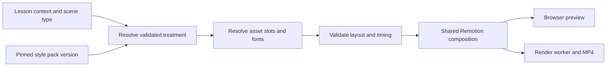

# Distinct creative styles: technical research

Date: 2026-09-17

Status: Research and proposed technical direction. This is input to a future scope update, ADR, and story-writing pass; it does not approve architecture changes or implement templates.

Scope: Proposal 1 of the video-style brainstorm: distinct creative styles. Motion and asset handling are included where necessary to make a style recognisable. User-created styles, reference matching, sophisticated automatic composition selection, and a general-purpose animation engine remain later work.

Method: Official Canva, Adobe, Blackmagic Design, and Remotion documentation, worked examples, and inspection of the repository. Product capabilities below are documented observations; suggested application designs are our own engineering proposals. No applications were operated, sample project files rendered, paid services called, or performance benchmarks run. Documentation establishes feasibility patterns, not the visual quality of an implementation we have yet to build.

## Recommendation

Implement versioned style packs inside the existing TypeScript/Remotion architecture. A pack should combine typography and colour tokens with authored scene treatments, asset-placement rules, motion behaviour, and validation. Start by proving Essential, Editorial, and Everyday on identical content.

The useful combination is Canva's bounded templates, Photoshop's replaceable layered content, and Fusion's reusable motion compositions with selected controls. This is an architectural inference from the examples below, not a claim about those products' internal implementation.

## What Canva demonstrates

### Brand Kit and Brand Templates have different jobs

Canva describes Brand Kits as collections of brand assets and Brand Templates as reusable designs carrying a broader signature style. Templates can lock selected elements while exposing others for editing. That distinction is directly relevant: colours and fonts provide consistency, but the template supplies the arrangement that makes a design recognisable. [Canva brand features](https://www.canva.com/business/features/brand/)

**Proposed application example:** An Editorial evidence scene would define an asymmetric photograph, a headline region, and a source annotation. Replacing its headline and photograph would preserve that composition. An Essential version of the same content would use a separate object-centred treatment.

**Implementation consequence:** Separate `StyleTokens` from `SceneTreatment`. A theme provider can supply tokens; it cannot, on its own, turn a text card into a photographic evidence layout.

### A real data-to-template example: the weather card

Canva's official Autofill guide demonstrates a template with `CITY`, `TEMPERATURE`, and `BACKGROUND` fields. The client discovers the field dataset, uploads media, submits typed values, and receives an asynchronously generated design. The current guide requires Enterprise membership for integration developers and users, with a development-access application route. [Canva Autofill guide](https://www.canva.dev/docs/connect/autofill-guide/)

**What transfers:** A design has a discoverable content contract. The generator fills named fields rather than deciding where pixels go.

**Proposed application example:** `editorial.comparison.evidence-panels` accepts left/right subjects, images, and evidence labels. Schema validation establishes what can be supplied, while the component owns position, hierarchy, and motion.

Do not use a template's sample facts as defaults when lesson data is missing. In an educational product, missing evidence should produce a validation issue or an explicitly approved alternate treatment.

### Frames separate media from its container

Canva frames act as image/video placeholders with a defined shape; the user can reposition or resize the media within them. [Canva frames documentation](https://www.canva.com/en_gb/help/using-frames-variantb/)

**Proposed application example:** A portrait and a landscape photograph can both fill an Editorial panel, using explicit crop policies. Essential cutouts use contain-fit so the complete object remains visible. Scientific diagrams default to contain-fit to preserve labels.

Each asset slot therefore needs accepted media types, fit mode, required/optional status, minimum useful resolution, and a supported focal-position policy. User-selected focal positions can be bounded metadata; AI should select supported framing labels, not emit arbitrary coordinates.

### Match & Move offers a continuity pattern

Canva documents Match & Move as animation of matching elements between pages. [Canva video transitions](https://www.canva.com/features/video-transitions/)

**Proposed application example:** A coin introduced in a hook remains identifiable when it becomes one side of a comparison. That would require persistent semantic object IDs and authored start/end layouts in our renderer.

This is useful later. Cross-scene object continuity is additional scope, and copying a transition's name will not create the underlying identity and timing system.

## What Photoshop demonstrates

### Smart Objects: change content while retaining treatment

Photoshop's Replace Contents operation preserves transformations when replacing a Smart Object's source. [Adobe Replace Contents guide](https://helpx.adobe.com/photoshop/desktop/create-manage-layers/smart-objects/replace-the-contents-of-a-smart-object.html)

**Proposed application example:** A documentary image sits inside a reusable frame with a mask, border, tonal treatment, and annotation anchor. Replacing the image preserves the surrounding design. The original source asset remains available independently.

Model this as `AssetSlot + resolved asset + authored treatment`. Keep editable labels and evidence text as renderer text, rather than flattening them into a background image.

### Layer Comps: named composition states

Layer Comps record visibility, position, appearance, and the selected comp of a Smart Object. They let designers manage multiple arrangements within one document. [Adobe Layer Comps](https://helpx.adobe.com/photoshop/using/layer-comps.html)

**Proposed application example:** An Essential hook could eventually have named question-first and object-first treatments. Their distinction includes which elements appear and how they are arranged.

Use separate named treatments when the hierarchy changes significantly. Share primitives such as labels and image frames, but avoid a giant component with dozens of style flags. For the initial proof, one treatment per selected scene type is enough.

### A real batch example: five banner versions

Adobe's data-driven graphics guide uses a banner-design scenario. A template defines visibility, text-replacement, and pixel-replacement variables, then applies datasets and previews the results. [Adobe data-driven graphics](https://helpx.adobe.com/photoshop/using/creating-data-driven-graphics.html)

**What transfers:** Test one authored design against many realistic datasets. A beautiful specimen containing a short title is insufficient evidence that the treatment can handle generated lessons.

Create fixture datasets for short and long headings, missing optional images, dense comparisons, different image orientations, and required diagrams. Preserve educational content when selecting a treatment; do not silently discard fields to make the layout fit.

### Adjustment layers and Libraries: reusable appearance without source mutation

Adjustment layers and Smart Filters support changes without overwriting original image data. Creative Cloud Libraries can share graphics, colours, text styles, and other reusable assets. [Adobe nondestructive editing](https://helpx.adobe.com/photoshop/using/nondestructive-editing.html), [Adobe Creative Cloud Libraries](https://helpx.adobe.com/ca/photoshop/using/cc-libraries-in-photoshop.html)

**Proposed application example:** Field Notes could apply a restrained paper treatment around an unmodified source diagram. Editorial photography could use a defined image treatment, while captions and factual diagrams remain outside that treatment.

In our product, saved appearance must resolve to immutable asset and pack versions. A shared library update must not silently change an approved lesson.

### Actual Photoshop integration is possible, but optional

Adobe currently recommends Photoshop API v2, including embedded/linked Smart Objects and scripted operations. Its overview marks v1 as deprecated with an end-of-life date of July 31, 2026. New integration work should use v2 documentation. [Photoshop API overview](https://developer.adobe.com/firefly-services/docs/photoshop/)

The v2 guides provide workflows to add/replace Smart Objects and inspect their manifest. The migration documentation distinguishes `fit`, `fill`, and explicit transformations, illustrating why crop semantics must be explicit. [Photoshop v2 workflows](https://developer.adobe.com/firefly-services/docs/photoshop/guides/photoshop-v2/v1-to-v2/guides-v2/), [Smart Object operations](https://developer.adobe.com/firefly-services/docs/photoshop/guides/photoshop-v2/v1-to-v2/layer-operations-smart-objects)

Recommendation: author or prepare assets in Photoshop when useful, export production-ready images, and keep per-frame composition in Remotion. A Photoshop service becomes worthwhile only if a demonstrated asset-preparation need justifies its integration, cost, and asynchronous processing.

## What DaVinci Resolve demonstrates

### Fusion macros expose a controlled interface

Blackmagic documents building reusable titles, backgrounds, and transitions by grouping composition nodes into a macro and choosing which parameters the editor can change. [Blackmagic Fusion templates](https://www.blackmagicdesign.com/products/davinciresolve/fusion)

**Proposed application example:** An Editorial evidence annotation exposes its text and target asset slot. Its line drawing, text placement, easing, and entrance sequence remain authored behaviour. Everyday can expose a numerical value while retaining its own token arrangement and movement.

A treatment should similarly expose a schema and metadata while its implementation owns the animation. We do not need to build a node editor to gain this benefit.

### Duration changes need an explicit motion policy

The Fusion 19.1 reference manual describes Keyframe Stretcher preserving entrance/exit timing while stretching the held interval. It also documents media drop zones, including replacing a background with a star-field through a template control. These are documented patterns from that manual version, not a claim about every current Resolve interface. [Fusion 19.1 manual, printed page 179](https://documents.blackmagicdesign.com/UserManuals/Fusion19_Manual.pdf)

**Proposed application example:** Author a 0.6-second reveal and a 0.4-second exit. For an eight-second scene, the remaining seven seconds carry the explanation. A longer narration extends the explanation interval rather than slowing the entrance. Those example values are design candidates to test, not established requirements.

Semantic events need separate treatment: deposits, graph changes, or evidence highlights should use explicit timed cues when available. Stretching a decorative title does not solve narration-aligned animation. For this first proposal, keep existing timing contracts and add only the style-specific motion needed by the proof scenes.

### Shared image treatment and per-image correction are separate

Resolve supports group grades before/after individual clip grades and shared correction nodes across clips. Its colour-management controls address input, timeline, and output transformations. [Blackmagic Resolve colour tools](https://www.blackmagicdesign.com/products/davinciresolve/color)

**Proposed application example:** Editorial photographs share a consistent restrained look, but individual images may first need exposure correction. A visual identity should not make a dark source image unreadable.

Our initial implementation can use prepared images and modest deterministic browser effects. A LUT or colour filter cannot establish composition, typography, or instructional structure. Preserve meaningful source colours in charts and diagrams, and verify browser previews against encoded outputs.

### Official practice material

Blackmagic supplies Introduction to Fusion, Basic Compositing, and Motion Graphics in Fusion training with videos and project files. These are useful reference exercises for a designer preparing motion samples. They were identified, not downloaded or executed during this research. [Official Resolve training](https://www.blackmagicdesign.com/products/davinciresolve/training)

## Mapping the six directions to concrete construction

These are original implementation proposals derived from the brainstorm. They are not vendor templates or verified finished designs.

| Style | Composition and assets | Motion construction | Main production challenge |
| --- | --- | --- | --- |
| Essential | Large typographic hierarchy, isolated objects, restrained framing, generous empty space | Frame-driven transforms, masks and restrained reveals | Good cutouts and precise hierarchy; sparse layouts expose weak assets |
| Editorial | Asymmetric photographic panels, evidence captions, source labels, strong headline blocks | Gentle image pushes, annotation reveals, deliberate cuts | Relevant licensed imagery, readable overlays, consistent crop and tonal treatment |
| Systems | Explicit graph structure, fine connectors, aligned labels, controlled gradients | SVG path tracing and timed signal markers | Diagram layout and preserving the factual meaning of relationships |
| Everyday | Consistent geometric illustration, familiar containers, prominent quantities | Grouped SVG transforms, token placement, restrained springs | A coherent illustration family and accurate quantities |
| Field Notes | Paper surfaces, source images, specimen arrangements, annotations | SVG stroke reveals and incremental callouts | Texture must remain subordinate to evidence and readability |
| Prism | Colour blocks, oversized type, strong geometric segmentation | Authored shape transformations and rhythmic reveals | Dense text and constant movement can overwhelm the explanation |

A coin splitting into allocations, for example, requires explicit amounts and a supported allocation visual contract. Styling alone cannot infer those amounts safely. Similarly, evaporation needs a subject-specific visual model. These broader teaching animations belong to proposal 2 and should not be hidden inside a style-pack estimate.

## Findings in this repository

The existing code provides a useful base, but style selection affects more than the provider.

| Inspected area | Current evidence | Proposed change |
| --- | --- | --- |
| [Video theme](D:/Eronmonsele/Documents/SoundMinds/product-app/packages/design-system/src/video-theme.ts) | Theme ID is the literal `mvp-default`; colour, typography, layout, and motion live together | Versioned token definitions; preserve the existing definition |
| [Theme provider](D:/Eronmonsele/Documents/SoundMinds/product-app/packages/design-system/src/video-theme-provider.tsx) | Always provides the singleton theme | Accept an explicitly resolved pack/theme |
| [Scene registry](D:/Eronmonsele/Documents/SoundMinds/product-app/packages/scene-library/src/scene-registry.tsx) | Ten semantic scene types each register a component and validation metadata | Resolve a compatible treatment using style, version, and semantic type |
| [Layout checks](D:/Eronmonsele/Documents/SoundMinds/product-app/packages/scene-library/src/layout.ts) | Uses global theme dimensions and an average character-width estimate of 0.55 | Treatment-aware constraints plus actual browser measurements |
| [Full lesson](D:/Eronmonsele/Documents/SoundMinds/product-app/packages/scene-library/src/full-lesson.tsx) | Shared theme also supplies captions and background | Pass resolved style through the complete composition, including captions |
| [Shared schema](D:/Eronmonsele/Documents/SoundMinds/product-app/packages/schemas/src/index.ts) | Lesson configuration and LessonSpec constrain the theme to `mvp-default` | Explicit versioned contract evolution and legacy reading path |
| [Render contracts](D:/Eronmonsele/Documents/SoundMinds/product-app/apps/renderer/src/contracts.ts) | Render identity hashes composition, assets, profile, and implementation version | Ensure resolved pack, treatments, fonts, and asset transformations affect identity |

All ten scene implementation files import `videoTheme`; shared graph/layout/timing helpers also refer to it. A provider-only refactor would leave those consumers unchanged. This was a targeted inspection, not an exhaustive audit of every application or persistence consumer.

The PRD's E11-US2 and technical guide explicitly specify one theme. ADR-001 retains Remotion/FFmpeg and shared TypeScript contracts. ADR-004 makes measured narration authoritative for playback duration. A future implementation must record the multi-style scope change and versioning decision while preserving narration and immutable approved versions.

## Proposed style-pack contract

Keep three concepts separate:

- **Semantic scene:** what the lesson explains, such as a comparison with two subjects and their differences.
- **Style pack:** the coherent visual direction and its version.
- **Treatment:** an authored way that style presents a particular semantic scene.

The rendering path would be:



A pack should declare its ID/version, tokens, font files, compatible semantic types, registered treatments, asset-slot contracts, motion rules, and representative fixtures. Each treatment should declare its input requirements, content limits, layout validator, renderer, and any named compatible fallback. Tokens describe appearance; treatment code owns layout and frame computation.

Illustrative persisted design selection, not a final schema:

```json
{
  "style": {
    "id": "editorial",
    "version": "1.0.0"
  },
  "sceneDesigns": {
    "scene-123": {
      "treatmentId": "comparison.evidence-panels",
      "treatmentVersion": "1.0.0"
    }
  }
}
```

The ADR should settle whether this lives directly in a new LessonSpec version or in a versioned design manifest referenced by the immutable lesson snapshot. Prefer direct LessonSpec integration unless inspection of versioning consumers reveals a concrete reason for a separate manifest. Do not pick a new schema-version number until that compatibility audit is complete.

Persist the resolved selection. Reopening an approved lesson must not rerun selection against whichever pack happens to be newest. AI may choose from compatible registered IDs; it cannot supply JSX, CSS, arbitrary coordinates, or executable animation expressions.

Proposed initial code ownership: contracts in `packages/schemas`, tokens/fonts in `packages/design-system`, and treatment registration/components in `packages/scene-library`. Avoid creating another package until dependency boundaries require one. Share layout primitives where appropriate, while allowing distinct compositions in each pack.

## Rendering, assets, and validation

**Rendering:** Use React/HTML for text and layout, SVG for paths and simple diagrams, and prepared raster assets for photography/textures. This is a proposed first implementation strategy. Remotion documents frame-driven properties, interpolation, and springs; it warns that animations unrelated to the current frame can cause rendering flicker. [Remotion animation documentation](https://www.remotion.dev/docs/animating-properties)

**Fonts:** Bundle the selected font files with recorded versions and wait for the correct weights to load before measuring or rendering. Remotion supports local font loading and recommends shared font-loading setup for multiple fonts. [Remotion fonts](https://www.remotion.dev/docs/fonts)

**Text measurement:** `measureText()` requires a browser; it does not run directly in Node or Bun. Use synchronous schema/limit checks in the API and a browser-based layout preflight in the existing background-job model. Load fonts before measuring, and measure final wrapped containers as well as individual strings. Match the measured CSS to the rendered CSS. [Remotion measureText](https://www.remotion.dev/docs/layout-utils/measure-text), [layout measurement best practices](https://www.remotion.dev/docs/layout-utils/best-practices)

The repository pins Remotion 4.0.507. Current documentation includes later-version features/defaults, so any new helper package must be checked against that pin. This research does not recommend an automatic framework upgrade.

**Content fitting:** Use approved line wrapping and bounded sizing first. If the scene still fails, report the field and compatible alternatives. Never silently remove a comparison point, conceal diagram labels, shrink below an agreed readable size, or shorten narration.

**Asset identity:** Record source asset ID, immutable version/checksum, role, crop/treatment metadata, and derived-output identity. Reuse the existing private asset-resolution and tenant checks. The same resolved assets must feed preview and render.

**Missing assets:** A required Editorial photograph should block that treatment. An approved alternative can be selected during draft editing and persisted; an approved render must not substitute a different design opportunistically. Preserve original scientific diagrams and factual colour coding.

**Reproducibility:** Pack version strings alone are insufficient. Retain the implementation bundle, font files, assets, resolved selections, and render environment identity needed to reproduce a version. Continue storing completed outputs. Do not promise byte-identical video files across arbitrary browser/encoder versions.

**Visual verification:** Check representative stills and complete clips. Static screenshots catch overlap and composition problems; clips reveal distracting pacing, broken entrances, or missing explanation intervals. Validate captions and readable contrast within every style, including photographic backgrounds.

## Should these products become runtime dependencies?

| Option | Suitable use | Recommendation for this project |
| --- | --- | --- |
| Native Remotion packs | Editable lesson text, deterministic layouts, shared preview/render | Core implementation |
| Canva | Reference templates, design exploration, an optional external design workflow | Learn its template boundaries; no required integration for this milestone |
| Photoshop desktop or API v2 | Preparing cutouts, layered image treatments, batch asset production | Optional asset-authoring/preprocessing tool |
| Resolve/Fusion | Authoring motion references and occasional fixed media elements | Optional creative tool; evaluate render-farm operation separately if ever needed |

Directly importing Canva designs, PSD layer trees, or Fusion macros into React would be a separate conversion project. This research found no demonstrated general bridge guaranteeing equivalent editable layouts, typography, effects, and motion in our renderer. A flattened export can be used as an asset, but does not preserve semantic editing.

Prefer original pack artwork and explicitly reusable assets. Canva's licence distinguishes Free and Pro Content and includes template-specific conditions; an export entitlement should not be assumed to cover redistributing its content inside our template system. [Canva Content License Agreement](https://www.canva.com/policies/content-license-agreement/)

## A bounded proof before production stories

Use the same approximately 20–30 seconds of approved lesson material, narration, and timing in Essential, Editorial, and Everyday. Include a hook, explanation/definition, and comparison. Prepare assets for each style so missing imagery does not dominate the experiment.

| Scene | Essential candidate | Editorial candidate | Everyday candidate |
| --- | --- | --- | --- |
| Hook | One large question with an isolated subject | Headline beside a tightly framed contextual photograph | Friendly illustrated situation with a short question |
| Explanation | Central object and clearly separated supporting labels | Photographic evidence with concise annotation | Familiar objects and a clear labelled relationship |
| Comparison | Two isolated subjects with sequential emphasis | Two evidence panels with source labels | Two illustrated situations using the same visual vocabulary |

This is nine authored treatments, not nine palette substitutions. Full initial release coverage is three styles multiplied by ten existing semantic types: thirty supported combinations, though implementations may share primitives. The proof should establish quality before committing to all thirty.

Suggested evaluation criteria, to refine during the proof:

1. In a shuffled contact sheet of the nine scenes, reviewers can identify the intended style across different scene types.
2. Reviewers can explain the same lesson facts after each version; no treatment drops meaning to improve appearance.
3. All clips pass safe-area, caption, text-fit, and required-asset checks.
4. Representative frames match between browser preview and server rendering within agreed tolerances.
5. Old `mvp-default` fixtures still produce the expected appearance through the compatibility path.
6. Record render time, memory, asset payload, and preflight duration against the current baseline. Set budgets from these measurements rather than inventing them now.

Repeat the proof with at least one different subject and boundary-content fixtures before claiming general template quality. A savings sample alone cannot establish how the packs handle a labelled biology diagram or an abstract technical concept.

## Decisions to carry into the BMAD-style planning pass

The research supports the following order of decisions and deliverables; these are planning inputs, not story cards or completed work.

| Order | Decision or evidence needed | Why it precedes implementation stories |
| --- | --- | --- |
| 1 | Record scope expansion, legacy compatibility, and design-version ownership | Establishes the authoritative contract and approved boundaries |
| 2 | Approve style boards, three-scene treatments, and asset requirements | Gives implementation concrete visual targets |
| 3 | Complete the nine-treatment proof with timing and text-fit evaluation | Tests whether the styles are distinct and feasible |
| 4 | Finalise schema, resolver, asset, font, validation, and render-identity contracts | Makes foundation work bounded and testable |
| 5 | Plan full ten-scene coverage for each of the first three packs | Prevents selling an incomplete style as a complete lesson option |
| 6 | Plan style selection, persisted previews, and integration regression coverage | Connects the proven system to the product workflow |

The central technical decision is supported by the research: preserve the semantic lesson model and implement authored, versioned presentations around it. The remaining uncertainty is creative quality and production cost, which require rendered prototypes rather than further architectural description.
